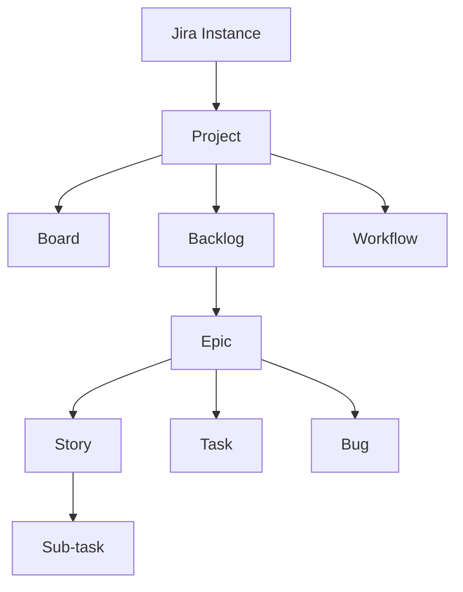
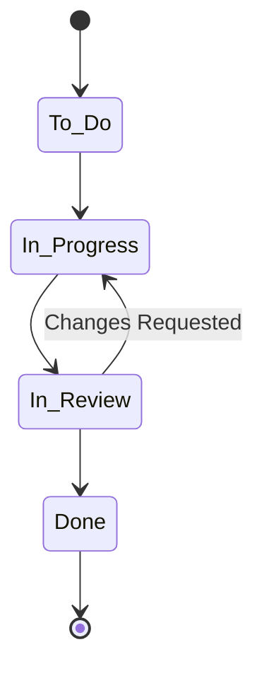

# Lab 001 - Jira Overview

!!! hint "Overview"

    - In this lab, you will learn the core concepts of Jira and how they fit together.
    - You will understand projects, issue types, workflows, boards, and how Jira supports agile methodologies.
    - By the end of this lab, you will have a mental model of how Jira organizes work.

## Prerequisites

- An Atlassian account with access to a Jira Cloud instance
- Web browser

## What You Will Learn

- What Jira is and why teams use it
- Core concepts: Projects, Issues, Workflows, Boards
- Difference between Scrum and Kanban project templates
- Issue types: Epic, Story, Task, Bug, Sub-task
- How issues relate to each other (linking, hierarchy)

---

## What is Jira?

Jira is Atlassian's project tracking and issue management tool. It is used by software teams, IT operations, business teams, and more to plan, track, and release work.

### Key Concepts



---

## Projects

A **Project** is a container for issues. Every piece of work in Jira lives inside a project.

| Property     | Description                                        |
| ------------ | -------------------------------------------------- |
| **Key**      | A short prefix for all issues (e.g., `DEV`, `OPS`) |
| **Type**     | Scrum, Kanban, or Bug Tracking                     |
| **Lead**     | The person responsible for the project             |
| **Category** | Optional grouping for multiple projects            |

### Demo: Explore an Existing Project

1. Log in to your Jira instance
2. Click **Projects** in the top navigation bar
3. Select any project (or the sample project created during setup)
4. Observe the left sidebar: **Board**, **Backlog**, **Timeline**, **Reports**, **Settings**
5. Click through each section to get familiar with the layout

---

## Issue Types

Issues are the building blocks of Jira. Each issue type serves a different purpose:

| Issue Type   | Purpose                                      | Icon                                |
| ------------ | -------------------------------------------- | ----------------------------------- |
| **Epic**     | Large body of work spanning multiple sprints | :material-lightning-bolt:           |
| **Story**    | User-facing feature or requirement           | :material-book-open-variant:        |
| **Task**     | A unit of work (not necessarily user-facing) | :material-checkbox-marked:          |
| **Bug**      | A defect or problem to fix                   | :material-bug:                      |
| **Sub-task** | A breakdown of a Story or Task               | :material-subdirectory-arrow-right: |

### Issue Hierarchy

```
Epic
├── Story
│   ├── Sub-task
│   └── Sub-task
├── Task
│   └── Sub-task
└── Bug
```

---

## Workflows

A **Workflow** defines the lifecycle of an issue — from creation to completion.

### Default Jira Workflow



| Status          | Meaning                           |
| --------------- | --------------------------------- |
| **To Do**       | Work has not started              |
| **In Progress** | Someone is actively working on it |
| **In Review**   | Work is complete, awaiting review |
| **Done**        | Issue is resolved and closed      |

---

## Boards

Boards provide a visual representation of your work.

### Scrum Board vs Kanban Board

| Feature        | Scrum Board          | Kanban Board          |
| -------------- | -------------------- | --------------------- |
| **Iterations** | Fixed-length sprints | Continuous flow       |
| **Backlog**    | Sprint backlog       | Single backlog        |
| **WIP Limits** | Per sprint capacity  | Per column limits     |
| **Metrics**    | Velocity, Burndown   | Lead Time, Throughput |
| **Best for**   | Planned releases     | Continuous delivery   |

### Demo: Viewing a Board

1. Navigate to your project
2. Click **Board** in the left sidebar
3. Notice the columns represent workflow statuses
4. Issues appear as cards — drag them between columns to transition

---

## Exercise

!!! question "Exercise 1: Explore Your Jira Instance"

    1. Log in to your Jira Cloud instance
    2. Navigate to **Projects** and list all available projects
    3. Open one project and identify:
        - The project key
        - The project type (Scrum or Kanban)
        - How many issues exist
    4. Open the **Board** view and identify the workflow columns
    5. Open one issue and examine its fields (Summary, Status, Assignee, Priority, Labels)

!!! question "Exercise 2: Understand Issue Relationships"

    1. Find an **Epic** in your project (or create one)
    2. Open the Epic and check its **child issues**
    3. Open a Story or Task and examine the **Details** panel
    4. Look for the **Links** section — note the relationship types (blocks, is blocked by, relates to)
