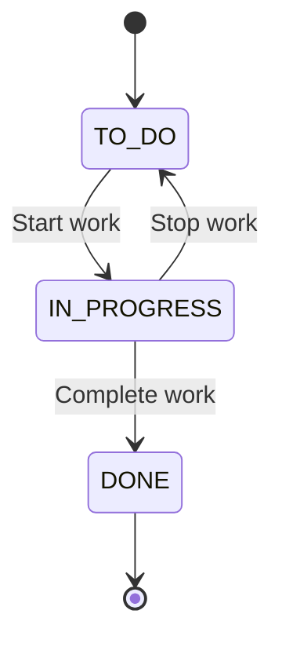
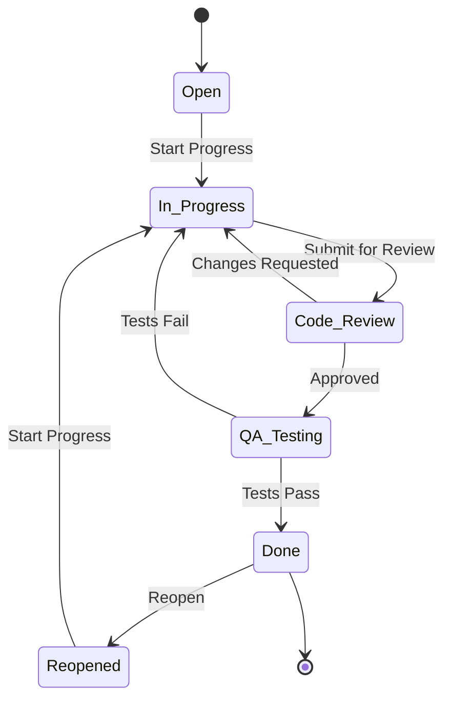

# Lab 004 - Workflow Basics

!!! hint "Overview"

    - In this lab, you will learn how Jira workflows govern the lifecycle of issues.
    - You will practice transitioning issues through statuses and understand workflow rules.
    - By the end, you will be comfortable moving issues through their complete lifecycle.

## Prerequisites

- Issues created in Lab 003 (or create new ones)
- Basic Jira navigation skills

## What You Will Learn

- What workflows are and why they matter
- Default workflow statuses and transitions
- How to transition issues between statuses
- Workflow status categories (To Do, In Progress, Done)
- Viewing workflow diagrams

---

## Understanding Workflows

A workflow is a set of **statuses** and **transitions** that an issue moves through from creation to completion.

### Status Categories

Every status in Jira belongs to one of three categories:

| Category        | Color  | Meaning              | Examples               |
| --------------- | ------ | -------------------- | ---------------------- |
| **To Do**       | Blue   | Work has not started | Open, Backlog, To Do   |
| **In Progress** | Yellow | Work is underway     | In Progress, In Review |
| **Done**        | Green  | Work is complete     | Done, Closed, Resolved |

!!! info "Why Categories Matter"

    Status categories drive board columns, reports, and JQL queries. An issue is considered "resolved" when it reaches a **Done** category status.

---

## Default Simplified Workflow

### Default Software Development Workflow

---

## Transitioning Issues

### Method 1: From the Board

1. Open your project's **Board**
2. Find an issue card in the **To Do** column
3. **Drag and drop** it to the **In Progress** column
4. The issue status updates automatically

### Method 2: From the Issue Detail

1. Open any issue
2. Click the **Status** button (shows current status, e.g., "To Do")
3. A dropdown shows available transitions
4. Select the target status (e.g., "In Progress")

### Method 3: Bulk Transition

1. Go to a filter or board
2. Select multiple issues (click checkboxes)
3. Click **Bulk change** → **Transition issues**
4. Select the target status
5. Confirm the change

---

## Demo: Walk an Issue Through Its Lifecycle

1. Create a new Task: `Test workflow transitions`
2. Observe its initial status: **To Do**
3. Click the status and select **In Progress**
4. Notice the status badge color changes to yellow
5. Click the status again and select **Done**
6. Notice the status badge turns green
7. Open the issue's **Activity** tab to see the transition history

---

## Viewing the Workflow Diagram

1. Open any issue
2. Click the **Status** button
3. Click **View workflow** (at the bottom of the dropdown)
4. A diagram shows all statuses and transitions
5. Your current position is highlighted

---

## Workflow Conditions and Validators

Some workflows have rules that control transitions:

| Rule Type         | Purpose                                | Example                                |
| ----------------- | -------------------------------------- | -------------------------------------- |
| **Condition**     | Who can perform this transition        | Only assignee can move to "In Review"  |
| **Validator**     | What must be true before transitioning | Resolution must be set before "Done"   |
| **Post Function** | What happens after the transition      | Auto-assign to reviewer on "In Review" |

---

## Exercise

!!! question "Exercise 1: Issue Lifecycle"

    Take 3 issues from Lab 003 and walk them through their complete lifecycle:

    1. Move issue from **To Do** → **In Progress** (using drag & drop on the board)
    2. Move issue from **In Progress** → **In Review** (using the status button)
    3. Move issue from **In Review** → **Done** (using the status button)
    4. Open the issue's Activity tab and review all transitions
    5. Repeat for the other 2 issues using different transition methods

!!! question "Exercise 2: Explore the Workflow"

    1. Open any issue and click **View workflow**
    2. Document all statuses and transitions in the workflow
    3. Identify:
        - Which statuses are in the "To Do" category?
        - Which statuses are in the "In Progress" category?
        - Which statuses are in the "Done" category?
        - Can you go backwards (e.g., from "Done" back to "In Progress")?

!!! question "Exercise 3: Reopen an Issue"

    1. Find a **Done** issue
    2. Can you transition it back to **In Progress** or **To Do**?
    3. If yes, do it and observe what happens to the resolution field
    4. If no, note what restrictions are in place
