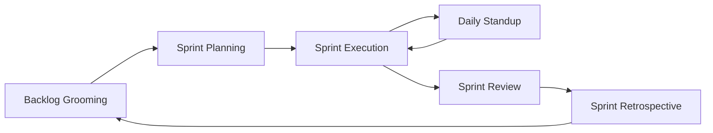

# Lab 006 - Boards & Sprints

!!! hint "Overview"

    - In this lab, you will work with Scrum and Kanban boards in Jira.
    - You will plan a sprint, execute it, and complete it.
    - By the end, you will understand the full sprint lifecycle and board management.

## Prerequisites

- A Scrum project with a backlog of issues (created in previous labs)
- Basic workflow knowledge from Lab 004

## What You Will Learn

- Scrum vs Kanban boards in detail
- Backlog grooming and sprint planning
- Running a sprint: daily standups perspective
- Completing a sprint
- Kanban board configuration with WIP limits
- Board column mapping and swimlanes

---

## Scrum Board

### The Sprint Lifecycle

### Backlog

The backlog is your ordered list of all work items not yet in a sprint.

1. Navigate to your project → **Backlog**
2. The backlog shows all unassigned issues at the bottom
3. Active sprint(s) appear at the top
4. Drag issues to reorder by priority (top = highest priority)

### Demo: Sprint Planning

**Step 1: Groom the Backlog**

1. Go to **Backlog** view
2. Review each issue — ensure it has:
   - A clear summary and description
   - Story points estimate
   - Appropriate priority
3. Drag to reorder: highest priority at top

**Step 2: Create a Sprint**

1. Click **Create sprint** in the Backlog view
2. A new sprint section appears above the backlog
3. **Drag issues** from the backlog into the sprint
4. Aim for a realistic scope based on team velocity

**Step 3: Start the Sprint**

1. Click **Start sprint**
2. Set the sprint details:
   - **Name**: `Sprint 1`
   - **Duration**: 2 weeks
   - **Start date**: Today
   - **End date**: Auto-calculated
   - **Sprint goal**: `Complete authentication module`
3. Click **Start**

**Step 4: Work the Sprint**

1. Navigate to the **Board** view
2. Issues appear in the **To Do** column
3. As you work, drag issues to **In Progress** → **Done**
4. The board updates in real-time

**Step 5: Complete the Sprint**

1. Click **Complete sprint** (appears when sprint end date is reached, or manually)
2. Review:
   - **Completed issues** — moved to Done
   - **Incomplete issues** — choose where to move them:
     - Next sprint
     - Back to backlog
3. Click **Complete**

---

## Kanban Board

Kanban boards provide continuous flow without fixed-length sprints.

### Key Concepts

| Concept         | Description                                         |
| --------------- | --------------------------------------------------- |
| **Columns**     | Represent workflow statuses                         |
| **WIP Limits**  | Maximum issues allowed per column                   |
| **Swimlanes**   | Horizontal rows to group issues (by epic, assignee) |
| **Card Layout** | Which fields appear on issue cards                  |

### WIP Limits

!!! warning "Why WIP Limits Matter"

    Work In Progress limits prevent overloading team members and reduce context switching. When a column hits its WIP limit, it turns red — signaling the team should finish existing work before starting new items.

### Demo: Configure a Kanban Board

1. Navigate to your Kanban project's **Board**
2. Click **Board settings** (gear icon)
3. Go to **Columns**:
   - Map statuses to columns
   - Set WIP limits:
     - To Do: No limit
     - In Progress: 3
     - In Review: 2
     - Done: No limit
4. Go to **Swimlanes**:
   - Choose **Based on Epics** for grouping
5. Go to **Card layout**:
   - Add fields to show on cards: Priority, Assignee, Labels

---

## Board Configuration

### Column Management

| Setting            | Description                                    |
| ------------------ | ---------------------------------------------- |
| **Add column**     | Create a new column (maps to a status)         |
| **Remove column**  | Remove a column (issues fall back to unmapped) |
| **Set constraint** | WIP limit per column                           |
| **Status mapping** | Which statuses belong to which column          |

### Quick Filters

Quick filters add one-click filtering to your board:

1. Go to **Board settings** → **Quick filters**
2. Add filters:
   - `Only my issues` — JQL: `assignee = currentUser()`
   - `Bugs only` — JQL: `type = Bug`
   - `High priority` — JQL: `priority IN (High, Highest)`

---

## Exercise

!!! question "Exercise 1: Run a Full Sprint"

    1. Go to your Scrum project's **Backlog**
    2. Ensure you have at least 8 issues with story points
    3. Create a sprint and drag 5-6 issues into it
    4. Start the sprint with a 1-week duration
    5. Transition all issues through the workflow on the board
    6. Complete at least 4 issues
    7. Complete the sprint — send incomplete issues to the backlog
    8. Review the sprint report (auto-generated)

!!! question "Exercise 2: Configure a Kanban Board"

    1. Create or use a Kanban project
    2. Open **Board settings**
    3. Configure columns: Backlog → Selected for Dev → In Progress → Review → Done
    4. Set WIP limits: In Progress = 3, Review = 2
    5. Add swimlanes based on Epics
    6. Add at least 2 quick filters
    7. Move issues through the board respecting WIP limits

!!! question "Exercise 3: Sprint Planning Practice"

    1. Create a backlog of 15 issues across 3 Epics
    2. Estimate all issues with story points (use Fibonacci: 1, 2, 3, 5, 8, 13)
    3. Prioritize the backlog by dragging issues
    4. Plan a sprint assuming team velocity of 20 points
    5. Verify the sprint total matches your capacity
