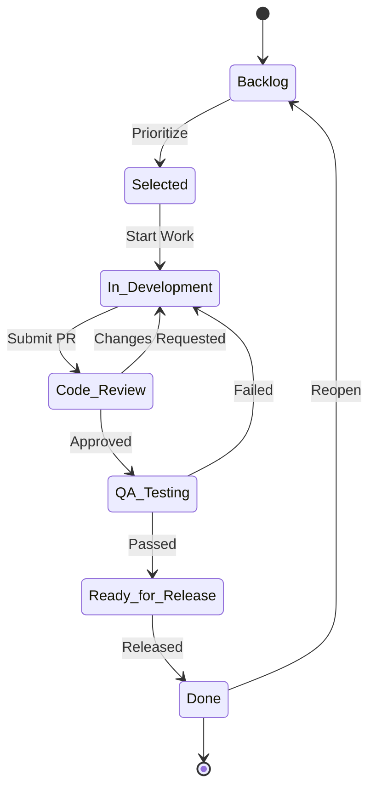

# Lab 010 - Workflow Customization

!!! hint "Overview"

    - In this lab, you will design and build custom workflows with transitions, conditions, and validators.
    - You will learn how to control who can transition issues and what happens automatically.
    - By the end, you will be able to create production-ready workflows.

## Prerequisites

- **Jira Administrator** permissions
- Understanding of workflow basics from Lab 004

## What You Will Learn

- Creating custom workflows from scratch
- Adding statuses and transitions
- Conditions (who can transition)
- Validators (what must be true)
- Post functions (what happens after)
- Workflow schemes and project association
- Publishing and activating workflows

---

## Workflow Designer

### Accessing the Workflow Editor

1. Go to **Jira Settings** → **Issues** → **Workflows**
2. Click **Add workflow**
3. Name: `Software Development Workflow`
4. The visual editor opens with a single status: `Open`

---

## Designing a Custom Workflow

### Recommended Software Development Workflow

### Step 1: Add Statuses

Add the following statuses:

| Status            | Category    |
| ----------------- | ----------- |
| Backlog           | To Do       |
| Selected for Dev  | To Do       |
| In Development    | In Progress |
| Code Review       | In Progress |
| QA Testing        | In Progress |
| Ready for Release | In Progress |
| Done              | Done        |

For each status:

1. Click **Add status** in the workflow editor
2. Enter the name
3. Select the status category
4. Click **Add**

### Step 2: Add Transitions

Connect statuses with transitions:

| From              | To                | Transition Name   |
| ----------------- | ----------------- | ----------------- |
| Backlog           | Selected for Dev  | Prioritize        |
| Selected for Dev  | In Development    | Start Work        |
| In Development    | Code Review       | Submit for Review |
| Code Review       | In Development    | Request Changes   |
| Code Review       | QA Testing        | Approve           |
| QA Testing        | In Development    | Fail QA           |
| QA Testing        | Ready for Release | Pass QA           |
| Ready for Release | Done              | Release           |
| Done              | Backlog           | Reopen            |

For each transition:

1. Click the source status
2. Click **Add transition**
3. Select the target status
4. Name the transition
5. Click **Create**

---

## Transition Rules

### Conditions

Conditions control **who** can perform a transition.

| Condition                | Use Case                                           |
| ------------------------ | -------------------------------------------------- |
| **Only Assignee**        | Only the assigned person can transition            |
| **Only Reporter**        | Only the person who created the issue              |
| **Permission Condition** | User must have a specific permission               |
| **User Is In Group**     | User must be in a specific group (e.g., `qa-team`) |
| **Sub-tasks Done**       | All sub-tasks must be completed                    |

### Demo: Add a Condition

1. Click on the **Approve** transition (Code Review → QA Testing)
2. Click **Conditions**
3. Add: **User Is In Group** → Group: `developers`
4. This means only developers can approve code reviews

### Validators

Validators ensure **required data** is present before a transition.

| Validator                | Use Case                              |
| ------------------------ | ------------------------------------- |
| **Field Required**       | A field must be filled in             |
| **Resolution Required**  | Resolution must be set before closing |
| **Permission Validator** | User must have specific permission    |
| **Regular Expression**   | Field value must match a pattern      |

### Demo: Add a Validator

1. Click on the **Release** transition (Ready for Release → Done)
2. Click **Validators**
3. Add: **Field Required** → Field: `Fix Version`
4. This ensures every released issue has a version tag

### Post Functions

Post functions define **what happens automatically** after a transition.

| Post Function                    | Use Case                               |
| -------------------------------- | -------------------------------------- |
| **Assign to Lead**               | Auto-assign to project lead on reopen  |
| **Update Field**                 | Set Resolution to "Done" on completion |
| **Clear Field**                  | Clear Resolution on reopen             |
| **Send Notification**            | Email the team on specific transitions |
| **Set Current User as Assignee** | Assign to whoever transitions          |

### Demo: Add Post Functions

1. Click on the **Done** transition
2. Add post function: **Update Issue Field** → Set `Resolution` to `Done`
3. Click on the **Reopen** transition
4. Add post function: **Update Issue Field** → Clear `Resolution`

---

## Workflow Schemes

A Workflow Scheme maps issue types to workflows:

1. Go to **Jira Settings** → **Issues** → **Workflow schemes**
2. Click **Add workflow scheme**
3. Name: `Software Development Workflow Scheme`
4. Map:
   - Bug → `Software Development Workflow`
   - Story → `Software Development Workflow`
   - Task → `Software Development Workflow`
   - Epic → `Simplified Workflow` (simpler lifecycle)
5. Associate the scheme with your project

---

## Exercise

!!! question "Exercise 1: Build a Custom Workflow"

    1. Create a new workflow: `Support Ticket Workflow`
    2. Add statuses: Open, Triaged, In Progress, Awaiting Customer, Resolved, Closed
    3. Add transitions between all appropriate statuses
    4. Add a condition: Only `support-team` group can transition from Open → Triaged
    5. Add a validator: `Resolution` required on transition to Closed
    6. Add a post function: Clear Resolution on Reopen transition

!!! question "Exercise 2: Workflow Scheme"

    1. Create a workflow scheme for a Support project
    2. Map Bug → `Support Ticket Workflow`
    3. Map Task → Default workflow
    4. Associate with a test project
    5. Create issues and verify the correct workflow is applied

!!! question "Exercise 3: Advanced Transitions"

    1. Add a **global transition** "Escalate" that can be triggered from any status → `Escalated` status
    2. Add a condition: only `managers` group can Escalate
    3. Add a post function: assign to the Project Lead on Escalation
    4. Test the transition from different statuses
