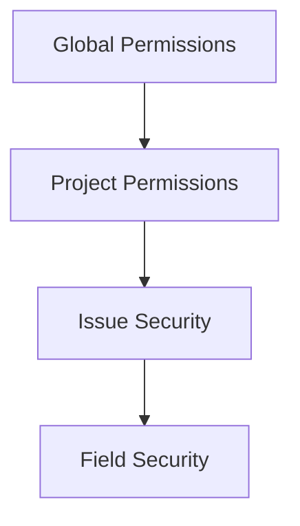

# Lab 011 - Permissions & Schemes

!!! hint "Overview"

    - In this lab, you will configure Jira permissions, security levels, and notification schemes.
    - You will learn how to control who can see, create, edit, and transition issues.
    - By the end, you will be able to set up a complete permission model for a project.

## Prerequisites

- **Jira Administrator** permissions
- Understanding of Jira groups and project roles

## What You Will Learn

- Permission schemes and project permissions
- Global vs project permissions
- Security levels and issue security schemes
- Notification schemes
- Project roles and group management

---

## Understanding Permissions

### Permission Levels

| Level                   | Scope                 | Controlled By               |
| ----------------------- | --------------------- | --------------------------- |
| **Global Permissions**  | Instance-wide actions | Jira System Admin           |
| **Project Permissions** | Per-project actions   | Permission Schemes          |
| **Issue Security**      | Per-issue visibility  | Issue Security Schemes      |
| **Field Security**      | Per-field visibility  | Field Configuration Schemes |

---

## Global Permissions

Global permissions control instance-wide actions:

| Permission                    | Description                             |
| ----------------------------- | --------------------------------------- |
| **Jira System Administrator** | Full system access                      |
| **Jira Administrator**        | Manage projects, schemes, and workflows |
| **Browse Users**              | View other users in the system          |
| **Create Shared Objects**     | Create shared filters and dashboards    |
| **Manage Group Filter Subs**  | Manage group filter subscriptions       |
| **Bulk Change**               | Perform bulk operations                 |

### Demo: Review Global Permissions

1. Go to **Jira Settings** → **System** → **Global permissions**
2. Review who has each permission
3. Note: Be restrictive with Admin permissions

---

## Project Permissions

### Permission Scheme

A Permission Scheme defines what users can do within a project.

1. Go to **Jira Settings** → **Issues** → **Permission schemes**
2. Review the **Default Permission Scheme**

### Key Project Permissions

| Permission              | Who Should Have It           | Description                     |
| ----------------------- | ---------------------------- | ------------------------------- |
| **Browse Projects**     | All team members             | View the project and its issues |
| **Create Issues**       | All team members             | Create new issues               |
| **Edit Issues**         | Assignee, Reporter, Admins   | Modify issue fields             |
| **Assign Issues**       | Project leads, Admins        | Assign issues to users          |
| **Resolve Issues**      | Developers, QA               | Set resolution on issues        |
| **Close Issues**        | Project leads, Admins        | Close/complete issues           |
| **Delete Issues**       | Admins only                  | Permanently delete issues       |
| **Manage Sprints**      | Scrum Masters, Project leads | Create, start, complete sprints |
| **Administer Projects** | Project admins               | Configure project settings      |

### Demo: Create a Permission Scheme

1. Click **Add permission scheme**
2. Name: `Restricted Development Scheme`
3. Add permissions:

   | Permission      | Grant To                          |
   | --------------- | --------------------------------- |
   | Browse Projects | Project Role: `Member`            |
   | Create Issues   | Project Role: `Member`            |
   | Edit Issues     | Reporter, Assignee, Role: `Admin` |
   | Delete Issues   | Project Role: `Admin`             |
   | Assign Issues   | Project Role: `Admin`, `Lead`     |
   | Manage Sprints  | Project Role: `Admin`, `Lead`     |

4. Associate the scheme with your project

---

## Project Roles

Project Roles provide a way to group users at the project level:

| Default Role       | Typical Members             |
| ------------------ | --------------------------- |
| **Administrators** | Project admins, Jira admins |
| **Developers**     | Development team members    |
| **Users**          | All project stakeholders    |

### Managing Roles

1. Go to **Jira Settings** → **System** → **Project roles**
2. View default roles: Administrators, Developers, Users
3. Add a custom role: `QA Team`
4. Go to **Project Settings** → **People**
5. Assign users to roles

---

## Issue Security Schemes

Issue security controls who can **see** individual issues:

### Creating an Issue Security Scheme

1. Go to **Jira Settings** → **Issues** → **Issue security schemes**
2. Click **Add issue security scheme**
3. Name: `Standard Security Scheme`
4. Add security levels:

   | Security Level | Who Can See           | Use Case                         |
   | -------------- | --------------------- | -------------------------------- |
   | **Public**     | All project members   | Default for most issues          |
   | **Internal**   | Developers and Admins | Internal technical discussions   |
   | **Restricted** | Admins only           | Sensitive issues (security bugs) |

5. For each level, specify who has access (groups, roles, or individual users)
6. Associate the scheme with your project

---

## Notification Schemes

Notification schemes control who gets emailed about issue events:

### Key Notification Events

| Event              | Default Recipients                |
| ------------------ | --------------------------------- |
| **Issue Created**  | Reporter, Project Lead, Watchers  |
| **Issue Updated**  | Assignee, Reporter, Watchers      |
| **Issue Assigned** | Assignee                          |
| **Issue Resolved** | Reporter, Watchers                |
| **Comment Added**  | All previous commenters, Watchers |
| **Issue Deleted**  | Reporter, Assignee                |

### Demo: Customize Notifications

1. Go to **Jira Settings** → **Issues** → **Notification schemes**
2. Copy the Default scheme
3. Name: `Minimal Notifications`
4. Remove notifications for minor events (reduce email noise)
5. Keep critical events: Created, Assigned, Resolved, Comment Added

---

## Exercise

!!! question "Exercise 1: Permission Scheme Design"

    Design and create a permission scheme for a team with these roles:

    - **Product Owner**: Can create issues, manage sprints, browse everything
    - **Developer**: Can create, edit, and resolve issues; cannot delete
    - **QA Engineer**: Can create bugs, transition issues, add comments
    - **Stakeholder**: Can only browse and add comments (read-mostly)

    Implement this using Project Roles and a custom Permission Scheme.

!!! question "Exercise 2: Issue Security"

    1. Create an Issue Security Scheme with 3 levels (Public, Internal, Confidential)
    2. Associate it with your project
    3. Create issues at each security level
    4. Verify that:
        - Public issues are visible to all members
        - Internal issues are visible only to Developers and Admins
        - Confidential issues are visible only to Admins

!!! question "Exercise 3: Notification Tuning"

    1. Create a custom Notification Scheme
    2. Configure it so that:
        - Assignee is notified on Assignment and Comment
        - Reporter is notified on Resolution and Comment
        - Watchers are notified on all events
        - Project Lead is notified only on Issue Created
    3. Associate the scheme with your project
    4. Test by performing actions and checking email notifications
