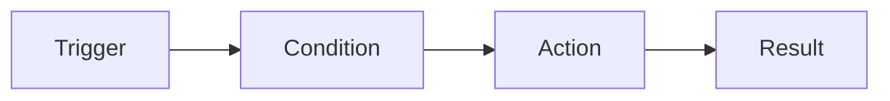

# Lab 012 - Automation Rules

!!! hint "Overview"

    - In this lab, you will build Jira automation rules to eliminate repetitive tasks.
    - You will create rules for auto-assignment, transitions, notifications, and more.
    - By the end, you will be able to automate common workflows and save hours of manual effort.

## Prerequisites

- **Jira Administrator** or **Project Admin** permissions
- A project with issues and workflows from previous labs

## What You Will Learn

- Jira Automation engine overview
- Triggers, conditions, and actions
- Common automation recipes
- Scheduled rules
- Smart values and variables
- Testing and debugging automation rules

---

## Jira Automation Overview

Jira Automation follows a simple pattern:



| Component     | Purpose                                  | Example                                 |
| ------------- | ---------------------------------------- | --------------------------------------- |
| **Trigger**   | What starts the rule                     | Issue created, field changed, scheduled |
| **Condition** | Optional filter to narrow when rule runs | Only if issue type = Bug                |
| **Action**    | What the rule does                       | Assign issue, add comment, transition   |

### Accessing Automation

1. Go to **Project Settings** → **Automation** (project-level rules)
2. Or **Jira Settings** → **System** → **Automation** (global rules)

---

## Common Triggers

| Trigger                      | Fires When                               |
| ---------------------------- | ---------------------------------------- |
| **Issue created**            | A new issue is created                   |
| **Issue transitioned**       | Status changes                           |
| **Field value changed**      | A specific field is updated              |
| **Comment added**            | Someone comments on an issue             |
| **Sprint started/completed** | Sprint lifecycle events                  |
| **Scheduled**                | On a cron schedule (e.g., daily at 9 AM) |
| **Manual trigger**           | User clicks a button to run              |
| **Issue linked/unlinked**    | Link added or removed                    |

---

## Automation Recipes

### Recipe 1: Auto-Assign Bugs to QA Lead

1. **Trigger**: Issue created
2. **Condition**: Issue type = Bug
3. **Action**: Assign issue to → `qa-lead@company.com`

### Demo: Create This Rule

1. Go to **Project Settings** → **Automation** → **Create rule**
2. Select trigger: **Issue created**
3. Add condition: **Issue fields condition** → Type = Bug
4. Add action: **Assign the issue** → Select QA Lead
5. Name the rule: `Auto-assign bugs to QA Lead`
6. **Turn on** the rule

---

### Recipe 2: Auto-Transition on Sub-tasks Complete

When all sub-tasks are Done, move the parent to "In Review":

1. **Trigger**: Issue transitioned (to Done)
2. **Condition**: Issue has sub-tasks AND all sub-tasks are Done
3. **Branch**: Parent issue
4. **Action**: Transition parent issue → In Review

### Demo: Create This Rule

1. Create a new rule
2. Trigger: **Issue transitioned** → To status: `Done`
3. Condition: **Related issues condition** → Sub-tasks → All match status `Done`
4. Branch: **Parent issue**
5. Action: **Transition issue** → `In Review`
6. Name: `Auto-transition parent when all sub-tasks done`

---

### Recipe 3: SLA Warning — Stale Issues

Alert when issues have been "In Progress" for more than 3 days:

1. **Trigger**: Scheduled → Every day at 9:00 AM
2. **Lookup**: JQL → `status = "In Progress" AND updated < -3d`
3. **Action**: Add comment → `⚠️ This issue has been in progress for 3+ days. Please update or flag blockers.`

---

### Recipe 4: Auto-Add Labels Based on Components

1. **Trigger**: Issue created
2. **Condition**: Component = `Frontend`
3. **Action**: Edit issue → Add label `frontend`

---

### Recipe 5: Welcome Comment on New Issues

1. **Trigger**: Issue created
2. **Action**: Add comment →

```
👋 Welcome! This issue has been created and is ready for prioritization.

**Next steps:**
- Add acceptance criteria to the description
- Set priority and story points
- Assign to a team member or let the team pick it up

_This is an automated message._
```

---

## Smart Values

Smart Values let you reference issue data dynamically:

| Smart Value                      | Returns                   |
| -------------------------------- | ------------------------- |
| `{{issue.key}}`                  | Issue key (e.g., DEV-123) |
| `{{issue.summary}}`              | Issue summary text        |
| `{{issue.assignee.displayName}}` | Assignee's name           |
| `{{issue.reporter.displayName}}` | Reporter's name           |
| `{{issue.status.name}}`          | Current status            |
| `{{issue.priority.name}}`        | Priority level            |
| `{{issue.created}}`              | Creation date             |
| `{{now}}`                        | Current date/time         |
| `{{issue.url}}`                  | URL to the issue          |

### Example: Dynamic Comment

```
Hi {{issue.assignee.displayName}},

Issue {{issue.key}} ({{issue.summary}}) has been moved to {{issue.status.name}}.

Priority: {{issue.priority.name}}
Due: {{issue.duedate}}
```

---

## Testing Automation Rules

### Audit Log

1. Go to **Automation** → **Audit log**
2. View execution history for all rules
3. Click on any execution to see:
   - Which trigger fired
   - Which conditions were evaluated
   - Which actions were performed
   - Any errors encountered

### Manual Testing

1. Create a rule with a **Manual trigger** first
2. Test it by clicking the trigger on an issue
3. Verify the actions work correctly
4. Change to the intended trigger (e.g., Issue created)

---

## Exercise

!!! question "Exercise 1: Build 3 Automation Rules"

    Create and test these rules:

    1. **Auto-assign**: When a Bug is created in your project, auto-assign it to yourself
    2. **Status notification**: When an issue moves to "Done", add a comment: `✅ This issue has been resolved by {{issue.assignee.displayName}}`
    3. **Stale alert**: Daily at 9 AM, find issues in "In Progress" for 3+ days and add a warning comment

!!! question "Exercise 2: Smart Value Templates"

    1. Create a rule that fires when an issue is assigned
    2. Add a comment using smart values:
        - Include the issue key, summary, assignee name, and priority
        - Include a link to the issue
    3. Test with 3 different issues and verify the dynamic content

!!! question "Exercise 3: Complex Automation"

    Build an automation workflow:

    1. When a **Story** is moved to "In Development":
        - Auto-create a Sub-task: `Code Review for {{issue.key}}`
        - Auto-create a Sub-task: `QA Testing for {{issue.key}}`
        - Add a comment summarizing the sub-tasks created
    2. Test by transitioning a Story and verify the sub-tasks appear
